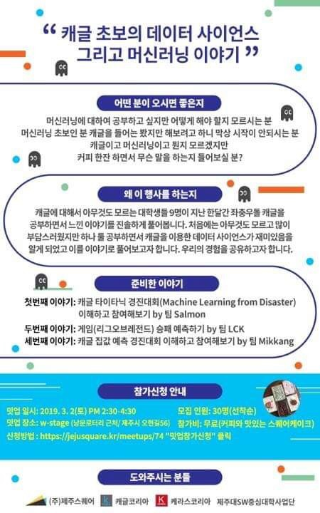

# SooHyeon
### resume

## Project

### 1. 간편 출석체크 App (저장소 => https://github.com/soohyeon13/dreamyjeju )  
-  개발 기술 : Android 개발 기간: 2019-05-13 ~ 2019-05-20  
&nbsp; &nbsp;    TODO 앱 설명  
<pre>
대표 기능
 -로그인
 -웹 크롤링
 -출석체크
</pre>    

### 2. Kaggle 타이타닉 컴피티션 밋업  
-  개발 기술: Python , Pandas 개발 기간: 2019-02 ~ 2019-03 팀 이름: Salmon(연어)  
&nbsp; &nbsp;    TODO 앱 설명  
  
  

### 3. Diary App (저장소 =>(Front) https://github.com/soohyeon13/DiraryApp , (Back) https://github.com/soohyeon13/diaryspringBoot)  
-  개발 기술: Android , SpringBoot , MySql 개발 기간: 2019-06-02 ~ 2019-06-21  
&nbsp; &nbsp;    TODO 앱 설명  
<pre>
대표 기능 
-로그인
-날짜 별 일정 등록/삭제
-날짜 별 메모 등록/삭제
-Google Calendar 가져오기
</pre>

