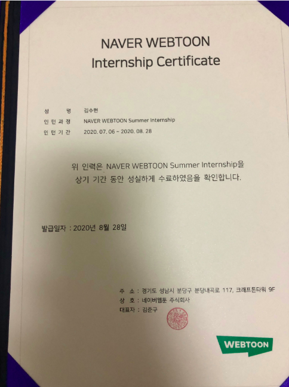
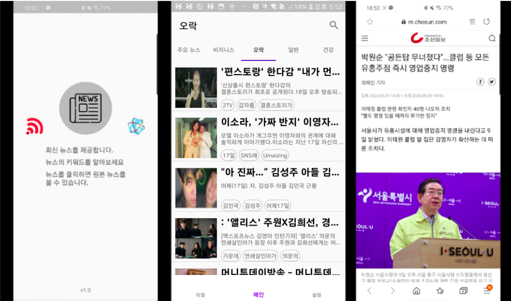
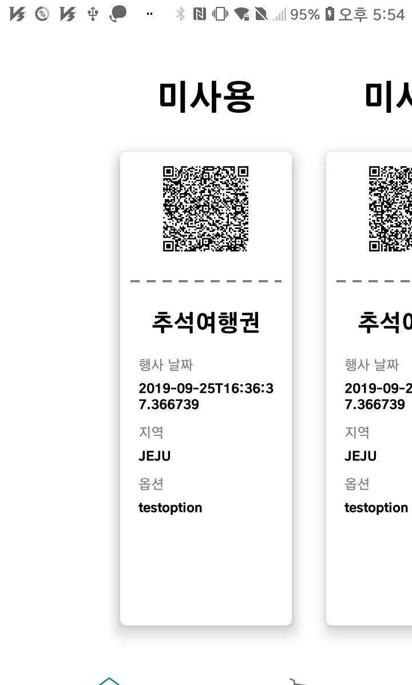
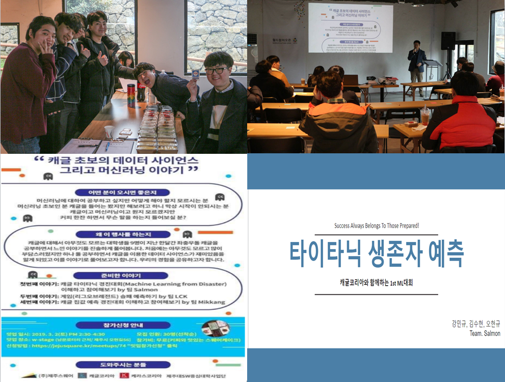

# SooHyeon

### "소통과 배려 그리고 협력"
&nbsp; &nbsp; '소통' 같은 공간에서 대화를 통해 서로의 의견을 공유합니다. 5명의 프로젝트를 시작했을때 전체회의를 진행하며 자신의 분야가 아니더라도 서로의 의견을 제시하여 더 좋은 방향을 찾아가는 경험을 한 적이 있습니다. 그리고 
&nbsp; &nbsp;'배려' 다른 분야의 개발부분도 경청과 의견제시를 통해 서로의 분야에 대한 적극적인 참여를 하며 배려를 했습니다.
&nbsp; &nbsp;'협력' 이러한 과정을 통해 서로의 부족한 부분을 인지하고 보충할 수 있었으며 더 나은 개발 방향을 찾을 수 있었습니다. 이런 과정으로 더 나은 결과를 얻을 수 있었습니다. 
### "배움의 의지"
&nbsp; &nbsp; 배움에는 끝이 없습니다. 항상 새로운 기술이 등장하고 더 나은 방법을 생각하게 됩니다. 저는 개발에 있어 먼저 생각을 합니다. "어떠한 방법을 사용하게 된다면 퍼포먼스를 올리고 좀 더 나은 결과물을 얻을 수 있을까." 이러한 생각을 통해 최신기술에 대한 두려움은 기대감이 되고 자신의 한계에 갇혀 있지 않을 것입니다. 저는 항상 배우는 자세에서 시작하여 더 나은 개발자가 될 수 있는 준비가 되어있습니다.
 
 ## 인턴

- 기업 : 네이버 웹툰
- 기간 : 2020.07.06 - 2020.08.28
- 분야 : 안드로이드 개발 

## Project
*사용가능언어-> Android(Kotlin,Java)
### 1. NewsFeed (저장소 -> https://github.com/soohyeon13/NewsFeed  
-  개발 기술 : Android(Kotlin), Retrofit2, MVVM, Databinding, Clean Architecture, Koin, Rx , Navigation 
   개발 인원 : 개인  
   개발 기간 : 2020-03-21 ~ 진행중  
&nbsp; &nbsp;
소개 : 다양한 언론사들의 최신 뉴스를 확인할 수 있는 앱입니다. 뉴스는 google news 의 rss 를 파싱했고 각 뉴스의 간략 정보(사진, 제목, 본문 요약) 을 노출시켜 사용자가 상세 뉴스를 보기 전 대략전인 내용을 알 수 있게 하였고 본문에서 빈도수에 따른 키워드를 뽑아 같이 보여주었습니다. 해당 뉴스의 상세페이지는 웹뷰를 사용해 뉴스 그대로를 보여주도록 했습니다.
역할 :Retrofit을 사용하여 Google News Rss 를 파싱해서 각 뉴스의 Url을통해 Html 파싱을 시도했습니다. 파싱은 원하는 부분만 가져오기 위해 Regex를 사용해서 필요 데이터를 가져왔고 키워드를 뽑을 때는 본문의 내용을 단어 단위로 잘라 Map<단어, 빈도수>의 형태로 넣어 정렬을 시도 했습니다.
기본적인 구조는 MVVM 패턴을 지키기 위해 노력하였고 Databinding 과 LiveData를 사용하여 ViewModel에서 데이터 관련 처리를 해주었습니다. 또한 의존성 주입, 관심사 분리에 대해 깊은 공부를 하고 싶어 Clean Architecture 와 Koin의 사용을 시도 했습니다. data 와 domain을 나눠 역할에 맡게 분리를 시도 했고 Koin을 통해 DI 를 시도했습니다. 

<pre>
기능
 - 최신 뉴스(google rss xml parsing)
 - 뉴스 검색(naver search api)-20.05.13 추가
 - 카테고리별 뉴스 최신 확인
</pre>

<pre>
 -문제점
   1. Clean Architecture를 도입하기 전 itemviewmodel에서 해당 url을 통해 파싱을 시도하고 recyclerview의 각 item에 bind를 시도했습니다. 하지만 데이터는 들어오지만 view의 데이터는 노출되지 않는 문제를 발견
   -해결 1-1 처음 Rss를 파싱할때 같이 Html도 파싱하고 데이터를 넘겨주는 방법과 Clean Architecture를 생각했습니다.
   2. 여기도 또 다른 문제점은 데이터의 순서를 보장할 수 없다는 문제를 발견
   -해결 2-1 Map에 index를 key로 넣어주어 observe 하기로 했지만 이 또한 사용자 입장에서 순차적인 순서로 view의 보여지지않아 불편함이 있을 것이라 생각하여 데이터가 load되는 순서로 observe 하는 방향으로 바꾸게 되었습니다.
   3. recyclerview 의 새로고침을 시각적인 효과가 보여지지 않은 문제
   -해결 3-1 원인은 diffutil의 리스트의 변화가 없기에 바뀌는 부분이 없을 것이라 생각했습니다. 그래서 adapter를 비워주어 리스트를 새로 할당해주는 방법을 생각했습니다.
   4. 간혈적 리스트에 데이터를 bind 시키지 못하는 버그발생 
   -해결 4-1 제가 생각하는 오류의 원인은 SSL Certificate때문이라 생각을 해서 okhttp client의 ssl 로직을 추가하는 시도를 했습니다. 하지만 error 로그에는 여전히 같은 오류가 발생하는 것을 확인했습니다.
   - http를 막아 놓은 문제로 인해 발생 하는것같은 생각(또 다른 생각) - 20.05.20
   이 문제는 아직 해결중에 있습니다.
   5.LiveData의 데이터가 중복되는 버그
   - BehaviorSubject를 reset 시키는 방법을 선택 -20.05.15
</pre>
 

### 2. 예약관리 (저장소 -> https://github.com/soohyeon13/ScheduleManagement 
-  개발 기술 : Android(Kotlin), Room, MVVM, Databinding, Clean Architecture, Koin , Navigation
   개발 인원 : 개인  
   개발 기간 : 2020-02-10 ~ 진행중  
&nbsp; &nbsp; 
소개 : 가게를 운영하는 누나가 예약관리를 할 수 있는 수단이 필요하다는 말에 시작하게 됬습니다. 클라이언트(누나)의 부탁은 스케줄 등록과 시간표 같이 시간단위로 스케줄을 보는 것이 좋다고 해서 스케줄 등록은 날짜와 시간, 세부 항목으로 등록을 하고 Calendar의 해당 날짜에 시간 단위로 RecyclerView을 사용하여 시간단위 스케줄을 item으로 보여주도록 하고 CRUD를 dialog를 통해 할 수 있도록 하였습니다.
역할 : Room 을 사용하여 원하는 컨텐츠의 스케줄을 등록하도록 하였습니다. 또한 Calendar 라이브러리를 사용하여 메인 화면에 Calendar를 보여주고 선택 날짜에 따른 스케줄 조회를 했습니다. 스케줄 조회는 TableLayout의 row를 시간단위로 설정 해당 날짜의 시간에 따라 View에 bind 되도록 했습니다. 현재 큰 문제점을 발견하여 리펙토링을 하고 있는 단계이고 기본적인 CRUD를 우선적으로 리펙토링 하고 정산을 통해 일별, 월별 조회가 가능하도록 할 예정입니다.      
<pre>
대표 기능
 -스케줄 예약
 -날짜별 시간표형태의 스케줄 확인 (tablelayout -> recyclerview -20.05.17)
</pre>    

<pre>
 -문제점
  1. 가장 큰 문제점으로 "탄탄하지 못한 DB 설계" 와 "전체적인 구조" 였습니다. 프로젝트가 커지고 요구사항이 들어올 때마다 보수가 어려웠다는 점이 있었습니 
  다. 
  해결 1-1 이에 따라 해결책으로 전체적인 구조 리펙토링을 시도했습니다. 
  2. 리펙토링 과정에서 서로간의 의존성이 분리 되어있지 않아 어려움이 많았습니다. 
  해결 2-1 Koin과 Clean Architecture 의 도입을 생각하게 되었습니다.
</pre>

### 3. 마이 리틀 티켓(마리켓) (저장소 -> https://github.com/mrfourfour/ticket-android, (학과 전시회 장려상 수상) 
-  개발 기술 : JAVA(Spring Webflux), DynamoDB, GraphQL, Docker, AWS ElasticBeanstalk, Travis(CI/CD), Android,Vue.js 
   개발 인원 : 5명  
   개발 기간 : 2019-09-22 ~ 2019-11-02  
&nbsp; &nbsp; 
소개 : 무형의 상품을 주로하는 판매하는 앱입니다. 목적은 티켓을 구매해도 현지에 가서 티켓으로 반환후 사용해야 하는 중간 과정을 없애고 사용자 와 관리자 간의 다이렉트로 사용처리가 될 수 있도록 하는 것을 목적으로 시작을 하게 됬습니다. 티켓의 경우 QRcode를 이용하여 사용자의 티켓 정보를 담았습니다. 그리고 티켓이라는 상품은 대부분 트레픽이 집중되는 문제, 사용자 입장에서 보기 좋은 View 이 두가지를 집중적으로 고려하여 진행했습니다.
역할 : 메인 화면에서 티켓을 단지 리스트형태로 보여주기 보단 실제 티켓의 형태로 보여주는 것을 시도했습니다. recyclerview 의 각 item의 사이즈, 페딩 값을 조절하여 표현하도록 했고, QRcode 는 SharedElementTransition를 사용해 효과를 더 해주었습니다. 관리자가 QRcode를 스캔하면 사용처리가 되도록 하였습니다.
GrahpQL을 사용함에 있어 호환성을 고려해 Retrofit 보단 Apollo Android 를 사용하는 것이 좋다고 판단하여 같이 사용했습니다.      
<pre>
대표 기능
 -로그인(Cognito 사용)
 -현재 보유중인 티켓,사용처리된 티켓에 대한 구분(Apollo + GraphQL)
 -구매자 앱에서 QRcode 스캔시 사용자앱에서 구매처리
 -QRcode에 대한 애니메이션 처리(Shared Element Transition)
 -지역별,카테고리별 상품조회(Apollo + GraphQL)
 -상품 상세 페이지와 구매 처리(Apollo + GraphQL)
</pre>    

<pre>
 -문제점
  1. 사용자 입장에서 편한 View 라는 개념이 모호 했습니다. 또한 Animation에 대한 이해도 부족으로 많은 시행착오를 겪게 되었습니다. 이번 기회에     
  Animation에 대한 이해도를 높일 수 있었습니다.
  2. GraphQL를 첫 시도 하면서 겪은 사용 환경문제. 사용환경을 구축하는 하고 이해부분에서 많은 시간을 들여야 했습니다. 하지만 기초부터 이해해가며 문제를 
  해결할 수 있었습니다.
  3. 트레픽이 집중됬을때 비동기 처리관련해 고민을 했습니다. 서버 파트의 동료와 고민을 하며 방법을 생각해 보려 했지만 정확한 해결 방법에
  대한 파악이 어려웠습니다.
</pre>
 

### 2. Let's trip (저장소 -> https://github.com/soohyeon13/Tourism)  
-  개발 기술: JAVA(android),Jetpack(Room, Navigation, Data Binding)  
   개발 인원: 1명 
   개발 기간: 2019-08-19 ~   
&nbsp; &nbsp; 여행에 대한 주제를 가지고 개발하게된 계기는 혼자 여행을 가고 싶을때와 먹거리에 대한 고민을 할때 선택지에 대한 고민을 덜고자 만들게되었습니다. 혼자 하는 프로젝트였기에 데이터베이스 통신에 있어 서버를 통하지 않고 내장 데이터베이스인 Room 디비를 사용하기로 했습니다. 그리고 현재 자신의 위치 GPS를 기반으로 한 날씨 정보를 얻어올수 있고 지도와 네비게이션 API를 활용했습니다. 비동기 통신은 Retrofit의 통신 기술을 사용했습니다. 많은 통신 기술이 있지만 그중에 Retrofit을 사용한 이유는 속도,편의성,가독성에서 기존 Asyntask와 비교해 더 좋다고 생각했기 때문입니다. 또한 Data Binding 을 활용해 코드 수를 줄이고 개발에 있어 편의성을 증가 시켰습니다.   
<pre>
대표 기능 
-현재 위치 날씨 조회
-세부 카테고리별 맛집/투어 조회
-좋아요를 통해 후에 가고싶은곳 등록/등록취소
-지역 검색을 통한 조회(Room)
-해당 지역에 대한 지도와 네비게이션(KaKao API)
</pre>
 

### 3. Kaggle 타이타닉 컴피티션 밋업 (350개 팀 중 43등 달성) 
-  개발 기술: Python , Pandas 
   개발 기간: 2019-01 ~ 2019-03 
   팀 이름: Salmon(연어)  
   팀 인원: 3명
&nbsp; &nbsp; 캐글 코리아에서 주최하는 타이타닉 생존자 예측 컴피티션을 참가했습니다.  
저희가 대회를 진행 하면서 데이터 분석 과정, 데이터 전처리과정, 모델링 과정 그리고 후기에 대해 머신러닝에 관심이 많은 사람들을 모아 발표를 해보았습니다. 대회 제출까지 해보았고 350개 팀중 43등을 했습니다.   
 

