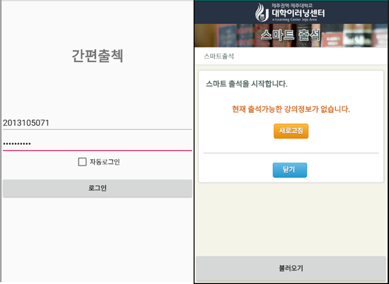
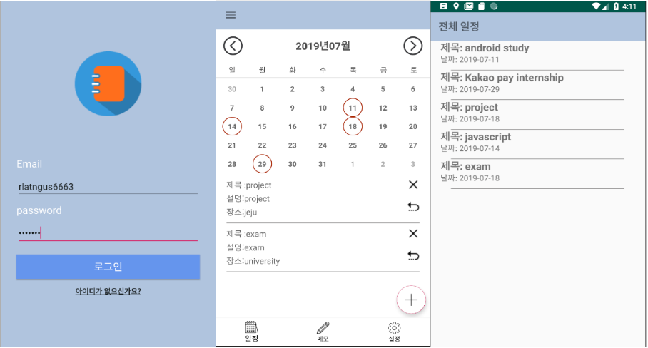

# SooHyeon
### "소통과 배려 그리고 협력"
&nbsp; &nbsp; 단체 생활에서 소통과 배려하는 자세는 꼭 필요하다고 생각합니다. 저는 아르바이트를 통해 소통과 배려를 경험하고 배울수 있었습니다. 저의 대부분의 아르바이트는 서비스업을 다양하게 했습니다. 그러다 보니 자연스럽게 다른 직원과의 소통을 많이 하게 되고 그 안에서 트러블에 대한 서로 간의 생각 차이를 이해하고 배려하는 과정을 배울 수 있었습니다. 
이러한 경험으로 트러블에 대한 조율과 동료들과의 협력을 이끌 수 있다고 생각합니다.
 

## Project

### 1. 간편 출석체크 App (저장소 => https://github.com/soohyeon13/dreamyjeju )  
-  개발 기술 : Android 개발 기간: 2019-05-13 ~ 2019-05-20  
&nbsp; &nbsp; 비동기 통신에 대해 공부 하던 중 실습을 하기 위해 프로젝트를 시작하였고 학교 출석체크페이지를 크롤링해서 간편하게 할 수 있도록 하였습니다.   
<pre>
대표 기능
 -로그인
 -자동로그인
 -웹 크롤링
 -출석체크
</pre>    
 

### 2. Kaggle 타이타닉 컴피티션 밋업  
-  개발 기술: Python , Pandas 개발 기간: 2019-02 ~ 2019-03 팀 이름: Salmon(연어)  
&nbsp; &nbsp; 캐글 코리아에서 주최하는 타이타닉 생존자 예측 컴피티션을 참가했습니다.  
저희가 대회를 진행 하면서 데이터 분석 과정, 데이터 전처리과정, 모델링 과정 그리고 후기에 대해 머신러닝에 관심이 많은 사람들을 모아 발표를 해보았습니다. 대회 제출까지 해보았고 350개 팀중 43등을 했습니다.   
 

### 3. Diary App (저장소 =>(Front) https://github.com/soohyeon13/DiraryApp , (Back) https://github.com/soohyeon13/diaryspringBoot)  
-  개발 기술: Android , SpringBoot , MySql 개발 기간: 2019-06-02 ~ 2019-06-21  
&nbsp; &nbsp; front는 안드로이드를 사용하여 개발 하였고 서버는 spring boot 를 사용했습니다. 여러 사용자를 고려하여  
<pre>
대표 기능 
-로그인
-날짜 별 일정 등록/삭제
-날짜 별 메모 등록/삭제
-전체 일정 / 메모 조회
-Google Calendar 가져오기
</pre>
 

