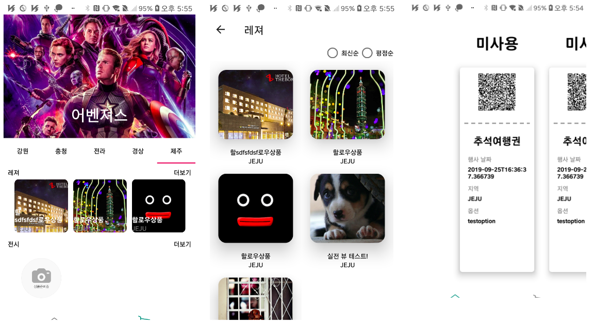

# SooHyeon
### "소통과 배려 그리고 협력"
&nbsp; &nbsp; 단체 생활에서 소통과 배려하는 자세는 꼭 필요하다고 생각합니다. 저는 아르바이트를 통해 소통과 배려를 경험하고 배울수 있었습니다. 저의 대부분의 아르바이트는 서비스업을 다양하게 했습니다. 그러다 보니 자연스럽게 다른 직원과의 소통을 많이 하게 되고 그 안에서 트러블에 대한 서로 간의 생각 차이를 이해하고 배려하는 과정을 배울 수 있었습니다. 
이러한 경험으로 트러블에 대한 조율과 동료들과의 협력을 이끌 수 있다고 생각합니다.
 

## Project

### 1. 마이 리틀 티켓(마리켓) (저장소 -> https://github.com/mrfourfour/ticket-android, (학과 전시회 장려상 수상) 
-  개발 기술 : JAVA(Spring Webflux), DynamoDB, GraphQL, Docker, AWS ElasticBeanstalk, Travis(CI/CD), Android,Vue.js 
   개발 인원 : 5명  
   개발 기간 : 2019-09-22 ~ 2019-11-02  
&nbsp; &nbsp; 무형 상품을 판매하고 티켓 등의 발권을 모바일로 바로 체크하고 사용처리까지 간편하게 이루어지는 앱입니다. 각 개발인력의 스킬 셋을 늘리기 위해 다양한 기술을 시도하기로 하였고 DevOps 를 통한 CI/CD와 협업을 공부하기 위해 개발했습니다. 협업에 대해서 체계적으로 공부하고 느껴보기 위해 한 주에 2번의 스크럼을 진행했습니다. 또한 이슈에 대한 대응 또한 회의를 통해 해결해 나가려 노력했습니다. 이번 프로젝트는 서버,웹,앱의 다양하게 개발을 진행하였고 그중에 제가 맞은 부분은 Android 개발 부분입니다. 티켓과 같은 상품들은 티켓 구매에 있어 한순간 트레픽이 증가할 수 있다는 점을 고려하여 비동기 처리에 더 집중해 개발했습니다. 또한 GraphQL 이라는 기술을 사용했습니다. 클라이언트 입장에서 많은 엔드포인트에 대한 부담을 덜어 줄수 있고 관리가 편리하다는 매력이 있었습니다. 이번 프로젝트를 통해 협업 했을 때와 개인의 프로젝트에 대한 장단점을 느낄 수 있었고, 협업에 있어 참여도와 팀워크에 중요성을 느낄수 있었습니다.       
<pre>
대표 기능
 -로그인(Cognito 사용)
 -현재 보유중인 티켓,사용처리된 티켓에 대한 구분(비동기 처리)
 -구매자 앱에서 QRcode 스캔시 사용자앱에서 구매처리
 -QRcode에 대한 애니메이션 처리
 -지역별,카테고리별 상품조회(비동기 처리)
 -상품 상세 페이지와 구매 처리(비동기)
</pre>    
     

### 2. Kaggle 타이타닉 컴피티션 밋업  
-  개발 기술: Python , Pandas 개발 기간: 2019-02 ~ 2019-03 팀 이름: Salmon(연어)  
&nbsp; &nbsp; 캐글 코리아에서 주최하는 타이타닉 생존자 예측 컴피티션을 참가했습니다.  
저희가 대회를 진행 하면서 데이터 분석 과정, 데이터 전처리과정, 모델링 과정 그리고 후기에 대해 머신러닝에 관심이 많은 사람들을 모아 발표를 해보았습니다. 대회 제출까지 해보았고 350개 팀중 43등을 했습니다.   
 

### 3. Diary App (저장소 =>(Android) https://github.com/soohyeon13/DiraryApp , (Server) https://github.com/soohyeon13/diaryspringBoot)  
-  개발 기술: Android , SpringBoot , MySql 개발 기간: 2019-06-02 ~ 2019-06-21  
&nbsp; &nbsp; Android 와 SpringBoot를 사용했습니다. 사용자가 일정과 메모를 관리할 수 있도록 기획했습니다. 여러 사용자를 고려해서 서버를 두게 되었고, 각 사용자에 따라 일정과 메모를 조회하기 위해 데이터베이스의 구조를 설계했습니다. 또한 Google OAuth를 사용해 구글 캘린더의 일정을 가져올 수 있도록 했습니다.   
<pre>려
대표 기능 
-로그인
-날짜 별 일정 등록/삭제
-날짜 별 메모 등록/삭제
-전체 일정 / 메모 조회
-Google Calendar 가져오기
</pre>
 

