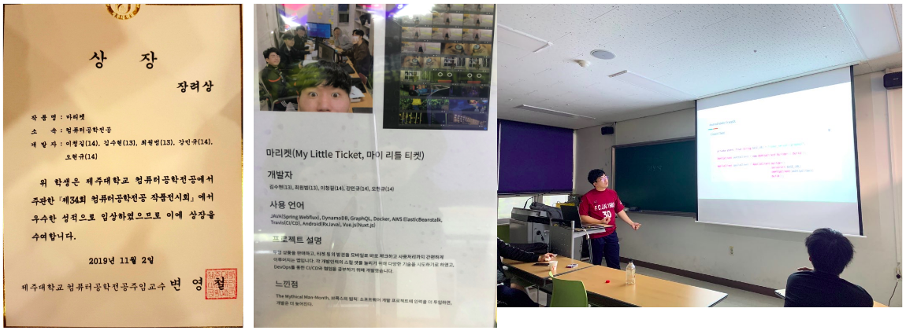

# SooHyeon

### "소통과 배려 그리고 협력"
&nbsp; &nbsp; '소통' 같은 공간에서 대화를 통해 서로의 의견을 공유합니다. 5명의 프로젝트를 시작했을때 전체회의를 진행하며 자신의 분야가 아니더라도 서로의 의견을 제시하여 더 좋은 방향을 찾아가는 경험을 한 적이 있습니다. 그리고 '배려' 다른 분야의 개발부분도 경청과 의견제시를 통해 서로의 분야에 대한 배려를 했습니다. '협력' 이러한 과정을 통해 서로의 부족한 부분을 인지하고 보충하여 더 나은 개발 방향을 찾을 수 있었습니다. 이러한 경험이 더 나은 결과를 얻을 수 있었고 앞으로 팀 프로젝트에서도 빛을 발할것입니다.
### "배움의 의지"
&nbsp; &nbsp; 배움에는 끝이 없습니다. 항상 새로운 기술이 등장하고 더 나은 방법을 생각하게 됩니다. 저는 개발에 있어 먼저 생각을 합니다. "어떠한 방법을 사용하게 된다면 퍼포먼스를 올리고 좀 더 나은 결과물을 얻을 수 있을까." 이러한 생각을 통해 최신기술에 대한 두려움은 기대감이 되고 자신의 한계에 갇혀 있지 않을 것입니다. 저는 항상 배우는 자세에서 시작하여 더 나은 개발자가 될 수 있는 준비가 되어있습니다.
 

## Project
*사용가능언어-> Android(Kotlin,Java)
### 1. 마이 리틀 티켓(마리켓) (저장소 -> https://github.com/mrfourfour/ticket-android, (학과 전시회 장려상 수상) 
-  개발 기술 : JAVA(Spring Webflux), DynamoDB, GraphQL, Docker, AWS ElasticBeanstalk, Travis(CI/CD), Android,Vue.js 
   개발 인원 : 5명  
   개발 기간 : 2019-09-22 ~ 2019-11-02  
&nbsp; &nbsp; 무형 상품을 판매하고 티켓 등의 발권을 모바일로 바로 체크하고 사용처리까지 간편하게 이루어지는 앱입니다. 각 개발인력의 스킬 셋을 늘리기 위해 다양한 기술을 시도하기로 하였고 DevOps 를 통한 CI/CD와 협업을 공부하기 위해 개발했습니다. 협업에 대해서 체계적으로 공부하고 느껴보기 위해 한 주에 2번의 스크럼을 진행했습니다. 또한 이슈에 대한 대응 또한 회의를 통해 해결해 나가려 노력했습니다. 이번 프로젝트는 서버,웹,앱의 다양하게 개발을 진행하였고 그중에 제가 맞은 부분은 Android 개발 부분입니다. 티켓과 같은 상품들은 티켓 구매에 있어 한순간 트레픽이 증가할 수 있다는 점을 고려하여 비동기 처리에 더 집중했고 또한 사용자 입장에서 View의 간단함과 Animation의 효과에 집중하여 개발했습니다. 또한 GraphQL을 사용했습니다. 그 이유는 클라이언트 입장에서 많은 엔드포인트에 대한 부담을 덜어 줄여 하나로 관리함에 따라 코드 수의 감소와 관리면에서의 편리함으로 선택하게되었습니다. 이번 프로젝트를 통해 협업 했을 때와 개인의 프로젝트에 대한 장단점을 느낄 수 있었고, 협업에 있어 참여도와 팀워크에 중요성을 느낄수 있었습니다.       
<pre>
대표 기능
 -로그인(Cognito 사용)
 -현재 보유중인 티켓,사용처리된 티켓에 대한 구분(비동기 처리)
 -구매자 앱에서 QRcode 스캔시 사용자앱에서 구매처리
 -QRcode에 대한 애니메이션 처리
 -지역별,카테고리별 상품조회(비동기 처리)
 -상품 상세 페이지와 구매 처리(비동기)
</pre>    
 

### 2. Let's trip (저장소 -> https://github.com/soohyeon13/Tourism)  
-  개발 기술: JAVA(android),Jetpack(Room, Navigation, Data Binding)  
   개발 인원: 1명 
   개발 기간: 2019-08-19 ~   
&nbsp; &nbsp; 여행에 대한 주제를 가지고 개발하게된 계기는 혼자 여행을 가고 싶을때와 먹거리에 대한 고민을 할때 선택지에 대한 고민을 덜고자 만들게되었습니다. 혼자 하는 프로젝트였기에 데이터베이스 통신에 있어 서버를 통하지 않고 내장 데이터베이스인 Room 디비를 사용하기로 했습니다. 그리고 현재 자신의 위치 GPS를 기반으로 한 날씨 정보를 얻어올수 있고 지도와 네비게이션 API를 활용했습니다. 비동기 통신은 Retrofit의 통신 기술을 사용했습니다. 많은 통신 기술이 있지만 그중에 Retrofit을 사용한 이유는 속도,편의성,가독성에서 기존 Asyntask와 비교해 더 좋다고 생각했기 때문입니다. 또한 Data Binding 을 활용해 코드 수를 줄이고 개발에 있어 편의성을 증가 시켰습니다.   
<pre>
대표 기능 
-현재 위치 날씨 조회
-세부 카테고리별 맛집/투어 조회
-좋아요를 통해 후에 가고싶은곳 등록/등록취소
-지역 검색을 통한 조회
-해당 지역에 대한 지도와 네비게이션
</pre>
 

### 3. Kaggle 타이타닉 컴피티션 밋업 (350개 팀 중 43등 달성) 
-  개발 기술: Python , Pandas 
   개발 기간: 2019-02 ~ 2019-03 
   팀 이름: Salmon(연어)  
   팀 인원: 3명
&nbsp; &nbsp; 캐글 코리아에서 주최하는 타이타닉 생존자 예측 컴피티션을 참가했습니다.  
저희가 대회를 진행 하면서 데이터 분석 과정, 데이터 전처리과정, 모델링 과정 그리고 후기에 대해 머신러닝에 관심이 많은 사람들을 모아 발표를 해보았습니다. 대회 제출까지 해보았고 350개 팀중 43등을 했습니다.   
 

